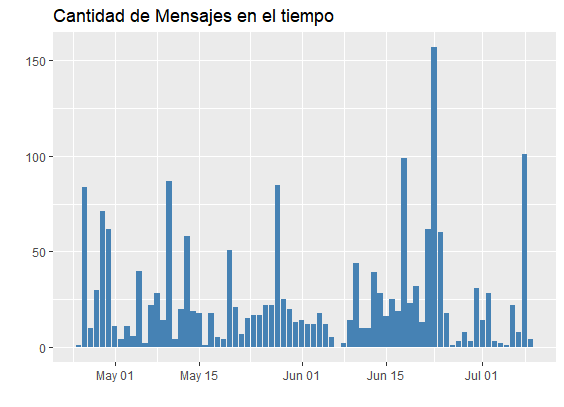
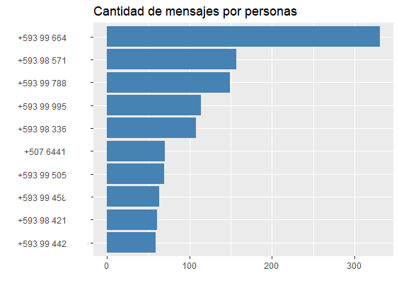
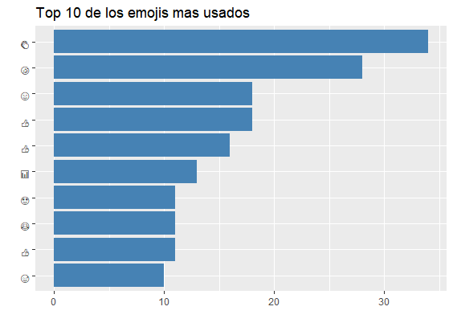
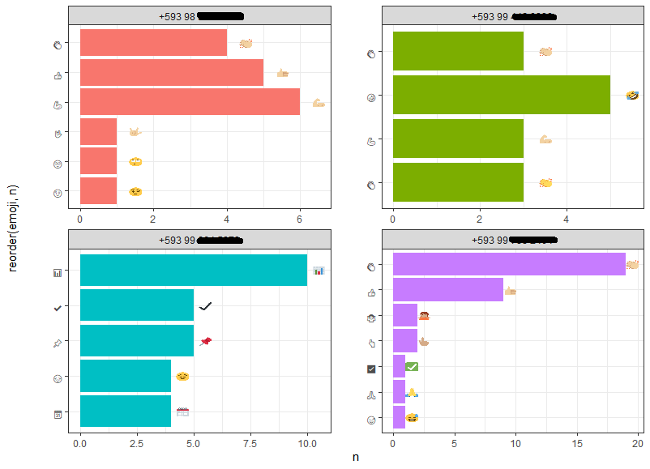
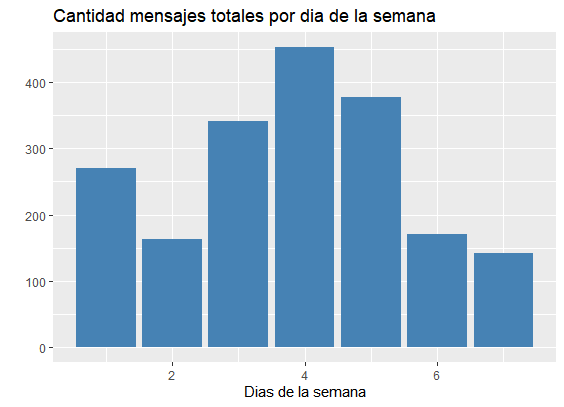
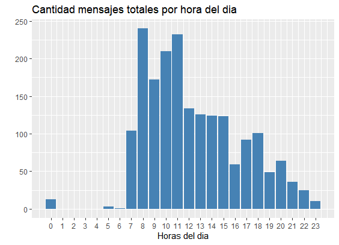

🦄 Análisis en R de un Chat grupal WhatsApp
===============================

Apuntes de un Análisis en R de un Chat grupal WhatsApp. 

Mas apuntes de Data Science y Machine Learning:

https://zpio.github.io/datascience/

### Contenido:

- [Instalar las librerias necesaria](#librerias)
- [Carga y transformación de los datos](#carga)
- [Visualización](#viz)
- [Extraer información](#info)


------------------------------------------------------------------------
Instalar las librerias necesarias <a name="librerias"></a>
===============================
```r
#install.packages("rwhatsapp")
library(rwhatsapp)
library(tidyverse)
library(lubridate)
```

Carga y transformación de los datos <a name="carga"></a>
===============================

**Exportar chat**

Previamente debe exportar un chat de WhatsApp desde la aplicacion movil, en este caso tendremos un chat de un grupo de WhatsApp. El archivo deberá ser un  `.txt`.

**Carga de los datos**

Con la función `rwa_read` del paquete `rwhatsapp` transforma facilmente el chat en un data.frame formateado con descripciones de los emojis utilizados.

```r
chat <- rwa_read("chat-data.txt")
```

**Estructura del data frame**

```r
glimpse(chat)

# Rows: 1,948
# Columns: 7
# $ time       <dttm> 2020-01-16 14:59:25, 2020-02-19 ...
# $ author     <fct> NA, +593 98 421 xxxx, +593 99 xxx...
# $ text       <chr> "Los mensajes y las llamadas está...
# $ source     <chr> "chat-data.txt", "chat-data.txt",...
# $ id         <int> 1, 2, 3, 4, 5, 6, 7, 8, 9, 10, 11...
# $ emoji      <list> [NULL, NULL, NULL, NULL, <"\U000...
# $ emoji_name <list> [NULL, NULL, NULL, NULL, <"house...
```
Las variables `emoji` y `emoji_name` son listas anidadas.

**Transformando los datos**

Transformanos el chat omitir mensajes que no tengan autores.

Creamos una columna para contar los caracteres del mensaje.

Creamos una columna para contar las palabras del mensaje.

Filtramos el chat para una periodo de fechas.

```r
chat <- rwa_read("chat-data.txt") %>% 
  filter(!is.na(author))%>%
  mutate(
    count_character = nchar(text),
    count_words = nchar(gsub('[^ ]+', '',text))+1,
    day = date(time)
  ) %>% 
  filter(day >= "2021-04-01")
```
```r
glimpse(chat)

# Rows: 1,918
# Columns: 10
# $ time            <dttm> 2021-04-25 20:10:18, 20...
# $ author          <fct> +593 98 336 xxxx, +593 9...
# $ text            <chr> "https://timetoherd.com/...
# $ source          <chr> "chat-data.txt", "chat-d...
# $ id              <int> 9, 10, 11, 12, 13, 14, 1...
# $ emoji           <list> [NULL, NULL, NULL, NULL...
# $ emoji_name      <list> [NULL, NULL, NULL, NULL...
# $ count_character <int> 34, 191, 20, 20, 91, 81,...
# $ count_words     <dbl> 1, 1, 2, 2, 13, 18, 17, ...
# $ day             <date> 2021-04-25, 2021-04-26,...
```

Visualización <a name="viz"></a>
===============================

**Cantidad mensajes en el tiempo**
```r
chat %>% 
  count(day) %>% 
  ggplot(aes(x = day, y = n))+
  geom_col(fill="steelblue")+
  labs(x = '', y='',
       title = 'Cantidad de Mensajes en el tiempo'
       )
 # Tambien se puede usar geom_bar(stat="identity")
```




**Top 10 de las personas que envian mas mensajes**
```r
chat %>% 
  count(author, sort = TRUE) %>% 
  slice_head(n=10) %>% 
  ggplot(aes(x = reorder(author, n), y = n))+
  geom_col(fill="steelblue")+
  coord_flip()+ 
  labs(
    x='', y='',
    title = 'Cantidad de mensajes por personas'
    )
```




**Top 5 de las personas que escriben mas palabras es los mensajes**
```r
top_chatters <- chat %>%
  group_by(author) %>% 
  summarise(count_words = sum(count_words)) %>% 
  slice_max(count_words, n=5) %>% 
  mutate(author = as.character(author))
```
```r
top_chatters

# A tibble: 5 x 2
# author               count_words
# <chr>                    <dbl>
# 1 +593 99 xxx xxxx        4134
# 2 +593 98 xxx xxxx        1722
# 3 +593 99 xxx xxxx        1411
# 4 +593 98 xxx xxxx        1345
# 5 +593 99 xxx xxxx        1068
```

**Top 10 de los emojis mas usados**
```r
chat %>%
  unnest(emoji) %>%
  count(emoji, sort = TRUE) %>% 
  slice_head(n=10) %>% 
  ggplot(aes(x = reorder(emoji, n), y = n))+
  geom_col(fill="steelblue")+
  coord_flip()+ 
  labs(x='', y='', 
       title = 'Top 10 de los emojis mas usados')
```




**Para ver los emojis con colores hay que hacer un paso previo**

En el paquete rwhatsapp incluye un tibble con el emoji, nombre y representacion hexadecimal.

```r
rwhatsapp::emojis
# A tibble: 4,085 x 3
# emoji        name                            hex_runes
# <chr>        <chr>                           <chr>    
# 1 "\U0001f600" grinning face                   1F600    
# 2 "\U0001f603" grinning face with big eyes     1F603    
# 3 "\U0001f604" grinning face with smiling eyes 1F604 
```

Limpiamos la representacion hexadecimal para construir una url que para obtener la imagen del emoji a través de la web.
```r
emoji_data <- rwhatsapp::emojis %>%
  mutate(hex_runes1 = gsub("\\s[[:alnum:]]+", "", hex_runes),
         hex_runes2 = gsub("\\+", "-", hex_runes1)) %>%
  mutate(emoji_url = paste0("https://abs.twimg.com/emoji/v2/72x72/", 
                            tolower(hex_runes2), ".png"))
```
```r
head(emoji_data)

#    emoji   name       hex_runes hex_runes1 hex_runes2 emoji_url       
#   <chr>   <chr>      <chr>     <chr>      <chr>      <chr>           
# 1 "\U000~ grinning ~ 1F600     1F600      1F600      https://abs.twi~
# 2 "\U000~ grinning ~ 1F603     1F603      1F603      https://abs.twi~
# 3 "\U000~ grinning ~ 1F604     1F604      1F604      https://abs.twi~
# 4 "\U000~ beaming f~ 1F601     1F601      1F601      https://abs.twi~
# 5 "\U000~ grinning ~ 1F606     1F606      1F606      https://abs.twi~
# 6 "\U000~ grinning ~ 1F605     1F605      1F605      https://abs.twi~
```
Los emojis mas usados por las personas mas chateadoras. 
```r
library("ggimage")
```
```r
chat %>% 
  unnest(emoji) %>% 
  count(author, emoji, sort = TRUE) %>% 
  group_by(author) %>% 
  slice_max(n, n=5) %>% 
  filter(author %in% top_chatters$author) %>% 
  left_join(emoji_data, by = 'emoji') %>% 
  ggplot(aes(x = reorder(emoji, n), y = n, fill = author)) +
  geom_col(show.legend = FALSE) +
  coord_flip() +
  geom_image(aes(y = n + 0.5, image = emoji_url)) +
  facet_wrap(~author, ncol = 2, scales = "free")+
  theme_bw()
```




**Cantidad mensajes totales por dia de la semana**
```r
chat %>%
  mutate(wday = wday(as.Date(time), week_start = 1)) %>%
  count(wday) %>%
  ggplot(aes(x = wday, y = n)) +
  geom_bar(stat = "identity", fill="steelblue") +
  labs(
    x='Dias de la semana', 
    y='', 
    title = 'Cantidad mensajes totales por dia de la semana'
    )
```




**Hora del dia en q se envian mas mensajes**
```r
chat %>%
  mutate(hour = hour(time)) %>%
  count(hour) %>%
  ggplot(aes(x = hour, y = n)) +
  geom_bar(stat = "identity",fill="steelblue") +
  labs(
    x='Horas del dia', 
    y='', 
    title = 'Cantidad mensajes totales por hora del dia') +
  scale_x_continuous(breaks = 0:23)
```




Extraer información <a name="info"></a>
===============================

**Numero de dias activos de chat**
```r
num_dias_activos <- chat %>% 
  summarise(no=length(unique(day))) %>%
  pull(no)
```
```r
num_dias_activos
# [1] 75
```

**Fecha mas antigua del chat**
```r
fecha_primera <-chat %>% 
  arrange(day) %>% slice(1) %>% 
  select(Oldest=day) %>%
  pull(Oldest)
```
```r
fecha_primera
# [1] 2021-04-25
```

**Fecha mas reciente del chat**
```r
fecha_ultima<-chat %>% 
  arrange(desc(day)) %>% 
  slice(1) %>% 
  select(Newest=day) %>%
  pull(Newest)
```
```r
fecha_ultima
# [1] 2021-07-29
```

**Total de dias transcurridos de chat**
```r
total_dias_transcurridos <- 
  as.numeric(fecha_ultima - fecha_ultima)
```
```r
total_dias_transcurridos
# [1] 75
```

**Total de dias sin mensajes**
```r
Total_dias_sin_msj <- 
   as.numeric(total_dias_transcurridos-num_dias_activos)
```
```r
Total_dias_sin_msj
# [1] 0
```

**% dias sin mensajes**
```r
percent_dias_sin_mnj <-
  round(Total_dias_sin_msj/total_dias_transcurridos *100,2)
```
```r
percent_dias_sin_mnj
# [1] 0
```

**La fecha mas activa**
```r
fecha_mas_activo <- chat %>% 
  count(day, sort = TRUE) %>% 
  slice(1) %>% 
  pull(day)
```
```r
fecha_mas_activo
#[1] "2021-06-23"
```

**El dia de la semana mas activo (mas mensajes se envian)**
```r
dia_semana_mas_activo <- chat %>% 
  mutate(wday = wday(as.Date(time), week_start = 1)) %>% 
  count(wday, sort = TRUE) %>% 
  slice(1) %>% 
  pull(wday)
```
```r
dia_semana_mas_activo
# [1] 4
```

**Total de mensajes**
```r
total_mensajes <- chat %>% 
  count() %>% 
  pull()
```
```r
total_mensajes
# [1] 1918
```

**Numero de usuarios**

```r
Total_usuarios <- 
  n_distinct(chat$author) 
```
```r
Total_usuarios
# [1] 124
```

**Promedio de Mensajes por dia**

```r
avg_msj_dia <- 
  as_tibble(total_mensajes/num_dias_activos) %>% 
  pull()
```
```r
avg_msj_dia
# [1] 25.6
```

**Numero de mensajes borrados**

```r
msj_borrados <- chat %>% 
  filter(text=="Este mensaje fue eliminado" | text=="Eliminaste este mensaje") %>% 
  count() %>% 
  pull()
```
```r
msj_borrados
# [1] 34
```

**Promedio de palabras por mensaje**

```r
avg_palabras<- chat %>% 
  summarise (n = mean(count_words)) %>% 
  pull()
```
```r
avg_palabras
# [1] 10.93326
```

**Promedio de caracteres por mensaje**
```r
avg_caracteres <-chat %>% 
  filter(text != "<Multimedia omitido>")%>% 
  filter(text != "Este mensaje fue eliminado") %>% 
  filter(text != "Eliminaste este mensaje") %>% 
  summarise (n = mean(count_character)) %>% 
  pull()
```
```r
avg_caracteres
# [1] 91.16667
```

**Cantidad total de emojis enviados**

```r
num_emojis <-chat %>% 
  unnest(emoji) %>% 
  count() %>% 
  pull()
```
```r
num_emojis
# [1] 476
```

**Cantidad de emojis unicos enviados**

```r
unicos_emojis <- chat %>%  
  unnest(emoji) %>% 
  count(emoji, sort = TRUE) %>% 
  count() %>% 
  pull()
```
```r
unicos_emojis
# [1] 180
```

**Cantidad multimedia enviados**

```r
num_medias <- chat %>% 
  filter(text == "<Multimedia omitido>") %>% 
  count() %>% 
  pull()
```
```r
num_medias
# [1] 384
```

**Cantidad de links enviados**

```r
num_links<- chat %>% 
  filter(str_detect(text,"www.")|str_detect(text,"http:")|str_detect(text,"https:")|str_detect(text,"youtu.be")) %>% 
  count() %>% 
  pull()
```
```r
num_links
# [1] 228
```

**Personas que salieron del grupo**

Primero hay que tener todo el chat incluyendo los sin autores:
```r
chat_global <- rwa_read("chat-data.txt") %>% 
  mutate(
    count_character = nchar(text),
    count_words = nchar(gsub('[^ ]+', '',text))+1,
    day = date(time)
  ) %>% 
  filter(day >= "2021-04-01")
```
```r
salieron_grupo <- chat_global %>% 
  filter(is.na(author)) %>% 
  filter(str_detect(text,".salió")) %>% 
  count() %>% 
  pull()
```
```r
salieron_grupo
# [1] 7
```


**Veces que el grupo cambio de nombre**

```r
cambios_nombre <- chat_global %>% 
  filter(is.na(author)) %>% 
  filter(str_detect(text,".asunto.")) %>% 
  count() %>% 
  pull()
```
```r
cambios_nombre
# [1] 0
```

**Hora en que se envian mas mensajes**

```r
chat %>% 
  mutate(hour = hour(time)) %>% 
  count(hour, sort = TRUE) %>% 
  slice(1) %>% 
  pull(hour)
```
```r
# [1] 8
```

Referencia
=============================

https://github.com/JBGruber/rwhatsapp


------------------------------------------------------------


